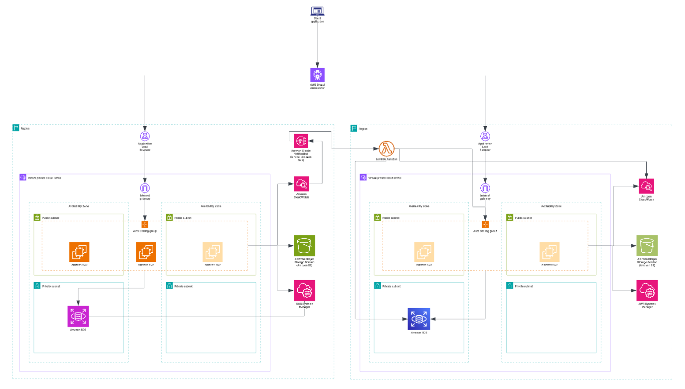

# AWS Disaster Recovery Project with Jenkins CI/CD Implementation

## Table of Contents
1. [Introduction](#introduction)
2. [Project Overview](#project-overview)
   - [Architecture](#architecture)
   - [Key Components](#key-components)
   - [Project Directory Structure](#project-directory-structure)
3. [Infrastructure Details](#infrastructure-details)
   - [VPC and Networking](#1-vpc-and-networking)
   - [EC2 (Elastic Compute Cloud)](#2-ec2-elastic-compute-cloud)
   - [RDS (Relational Database Service)](#3-rds-relational-database-service)
   - [S3 (Simple Storage Service)](#4-s3-simple-storage-service)
   - [Lambda (Serverless Compute)](#5-lambda-serverless-compute)
   - [Application Load Balancer (ALB)](#6-application-load-balancer-alb)
   - [Global Accelerator](#7-global-accelerator)
   - [IAM](#8-iam)
   - [Monitoring and Failover](#9-monitoring-and-failover)
4. [Setup Instructions](#setup-instructions)
   - [Prerequisites](#prerequisites)
5. [Conclusion](#conclusion)
6. [Additional Resources](#additional-resources)

## Introduction

This is a comprehensive Disaster Recovery (DR) project utilizing Terraform to deploy a three-tier application in AWS, implementing the Pilot Light strategy. The goal is to ensure the application remains operational with failover capabilities in the event of a disaster, while meeting Recovery Time Objective (RTO) and Recovery Point Objective (RPO) requirements in a cost-effective manner.

The architecture spans multiple regions, with a primary region hosting the fully operational environment and a secondary region maintaining a minimal replica—the "pilot light." In this strategy, only the core components required to start the application are kept running in the secondary region, while additional resources can be scaled up rapidly when a disaster occurs. Terraform is used to define infrastructure as code, enabling consistent, repeatable deployments and simplified recovery procedures.

The Continuous Integration (CI) processes for the frontend and backend applications are abstracted from this setup. Instead of managing CI pipelines within the project, users are only required to provide the container image URLs for deployment. While images hosted on Amazon Elastic Container Registry (ECR) are preferred for integration and performance reasons, other image registries are also supported.

## Project Overview

The DR project in AWS adopts the Pilot Light strategy, maintaining a minimal set of essential resources in the secondary region that can be quickly scaled up in the event of a disaster. The infrastructure is organized into modular Terraform components, with each AWS service managed through its own module to enhance maintainability and support future scalability.

## Architecture

The overall architecture implements a cross-region disaster recovery solution with automated failover capabilities:



To reduce latency and ensure availability, it is recommended that if Amazon ECR is used for container images, the repositories be replicated across both regions involved in the disaster recovery setup.

### Workflow Overview

The system uses an EC2 instance as the base to create an Amazon Machine Image (AMI), which serves as the source for a Launch Template used by Auto Scaling Groups (ASGs). Two ASGs are defined: a fully scaled group in the primary region and a minimal, scaled-down group in the secondary (DR) region.

Secrets and configuration parameters are stored in AWS Systems Manager Parameter Store and replicated across both regions. These are consumed via the Launch Template’s user data script to initialize instances and run application processes.

Monitoring is handled by Amazon CloudWatch. The application stores data in an S3 bucket configured with cross-region replication to ensure object durability and availability. It uses a managed relational database (RDS) in the primary region, with a read replica configured in the secondary region.

CloudWatch alarms are configured to track key metrics such as load balancer health checks and RDS connection pool status. When a failure is detected, these alarms trigger an Amazon SNS topic, which both notifies stakeholders via email and invokes a Lambda function in the secondary region.

This Lambda function promotes the read replica to a standalone, writable RDS instance and activates the DR infrastructure. It does this by launching new instances using the secondary Auto Scaling Group, which references a Launch Template copied from the primary region’s AMI—enabling seamless failover and rapid recovery.


### Key Components

1. **EC2 (Elastic Compute Cloud)**:

   * **Primary Region**: Hosts the application and backend services via EC2 instances managed by an Auto Scaling Group (ASG) using a custom AMI.
   * **Secondary Region**: Maintains a scaled-down ASG using the same AMI, ready to scale up rapidly during failover. Instances are initialized using user data and replicated parameters from Systems Manager Parameter Store.

2. **RDS (Relational Database Service)**:

   * **Primary Region**: Runs the primary database for the application.
   * **Secondary Region**: Hosts a read replica of the primary database, which can be promoted to a standalone writable instance during a failover event. Automated backups and cross-region snapshot support ensure data availability.

3. **S3 (Simple Storage Service)**:

   * Stores application data and assets with Cross-Region Replication (CRR) enabled to sync objects between buckets in both regions. Versioning and lifecycle policies are applied to maintain data integrity and manage costs.

4. **Lambda (Serverless Compute)**:

   * Deployed in the secondary region to automate failover processes. When triggered by CloudWatch alarms via SNS, it promotes the RDS read replica and initiates instance scaling in the DR region using the pre-configured launch template.

5. **VPC and Networking**:

   * Separate Virtual Private Clouds (VPCs) are deployed in each region with structured public and private subnets, NAT gateways, and security groups. Networking is designed to support isolation, redundancy, and secure communication across tiers.

6. **Application Load Balancer (ALB)**:

   * In the primary region, distributes traffic across EC2 instances. Health checks are configured to detect failures and trigger CloudWatch alarms. A load balancer in the secondary region can be activated as part of the failover process.

7. **Global Accelerator (Optional: Ideally Route 53 is a better option for this use case)**:

   * Can be used to route user traffic intelligently across regions based on endpoint health and latency, ensuring smooth and automatic redirection during failover events.

8. **IAM (Identity and Access Management)**:

   * Manages roles and permissions for EC2 instance profiles, Lambda execution, S3 replication, and failover automation components, ensuring secure and controlled access.

9. **Monitoring and Alerts**:

   * CloudWatch monitors the health and performance of EC2 instances, RDS, and ALB. Alarms are configured to detect anomalies (e.g., instance failure, DB unavailability) and publish notifications to an SNS topic. This triggers automated failover via Lambda, minimizing downtime.

10. **AMI (Amazon Machine Image)**:

    * A pre-built AMI is created from a baseline EC2 instance and used across both regions for consistent environment replication. This AMI serves as the foundation for Launch Templates in Auto Scaling Groups.

11. **Container Image Deployment**:

    * CI processes for frontend and backend services are abstracted. Users provide image URLs—preferably hosted in Amazon ECR and replicated across regions—but other registries (e.g., Docker Hub) are also supported for flexibility.

### Project Directory Structure

The project is organized as follows:

```
.
├── main.tf                  # root Terraform config
├── modules                  # reusable service modules
│   ├── alb                  # ALB setup
│   ├── ami_from_ec2         # EC2 AMI handling
│   ├── asg                  # Launch Template & ASG definitions
|   ├── asg_iam_role         # IAM Role for autoscaling group
│   ├── cloudwatch_alarm     # CloudWatch alarms
│   ├── ec2                  # ECR module for creating an EC2 from which AMI will be created
│   ├── global_accelerator   # Global Accelerator config
│   ├── instance_profile     # Instance profile for asg launch templates
│   ├── lambda               # Lambda function for failover orchestration
│   ├── lambda_permissions   # Handles the necessary permissions that will be needed by lambda to successfully interract with all the resources it needs for a complete failover to be done
│   ├── parameter_store      # Stores the needed secrets and environment variables 
│   ├── rds                  # RDS & replica setup
│   ├── s3                   # S3 buckets & replication
│   ├── secondary_failover   # failover orchestration
│   ├── security_group       # security groups
│   ├── sns                  # SNS topic 
│   └── vpc                  # VPC & subnet layout
├── outputs.tf               # Terraform outputs
├── providers.tf             # AWS provider config
├── README.MD                # project overview & steps
├── docker-compose.yml       # Docker compose file to be used to state applications within EC2
├── terraform.tfvars         # variable values
└── variables.tf             # variable declarations
```

## Infrastructure Details

### 1. VPC and Networking

* **Primary VPC**:

  * Created using the `vpc` module with public subnets for hosting the application and private subnets for the database tier, all distributed across multiple availability zones to enhance fault tolerance.
  * Security groups, managed through the `security_group` module, enforce access control between components such as compute instances, the database, and load balancers.

* **Secondary VPC**:

  * Provisioned using the `vpc_secondary` module with a mirrored network structure, maintaining a separation between public-facing and private components to support the disaster recovery environment.

* **Global Accelerator**:

  * Configured via the `global_accelerator` module to direct user traffic to the healthy region, using endpoint health checks to determine availability and provide automatic failover.


### 2. EC2 (Elastic Compute Cloud)

* **Primary Region**:

  * Application instances are deployed using the `ec2` module with an Auto Scaling Group (ASG) that actively runs and serves traffic through the Application Load Balancer (ALB). Instances are launched with an IAM instance profile and are automatically registered with the appropriate ALB target group.

* **Secondary Region**:

  * Configured using the `ec2_secondary` module with an ASG that maintains zero running instances under normal conditions to reduce operational costs. Instances are only launched during a failover event, using the same pre-configured AMI as the primary region to ensure consistency.

* **AMI Management**:

  * The `ami` module handles the creation and distribution of a standardized machine image used across both regions. This ensures that instances launched during failover are identical to those in the primary environment.

* **Automation**:

  * Failover automation is driven by ASG policies and a Lambda function that is triggered during a disaster scenario. This function scales up the secondary region's infrastructure and promotes backend resources as needed to restore full service.

### 3. RDS (Relational Database Service)

* **Primary RDS**:

  * Provisioned using the `rds` module in the primary region to serve as the main application database. Configuration favors cost efficiency while maintaining availability. Credentials are securely stored in AWS Systems Manager (SSM) Parameter Store.

* **Secondary RDS**:

  * A read replica is deployed in the secondary region to continuously replicate data from the primary database. It resides within a dedicated subnet group and can be promoted to a standalone database instance during failover.

* **Backups**:

  * Automated backups are enabled to preserve recent data, and manual snapshots can be created via a Lambda function. This ensures that both point-in-time recovery and disaster resilience are supported.


### 4. S3 (Simple Storage Service)

* **Primary Bucket**:

  * Created using the `s3` module, the primary bucket is configured with versioning and lifecycle policies to ensure efficient and cost-effective data storage.

* **Secondary Bucket**:

  * A secondary bucket is set up to replicate data from the primary bucket using Cross-Region Replication (CRR). Access is managed through an IAM role that facilitates the replication process.

* **Data Integrity**:

  * Versioning is enabled in both buckets to protect against accidental data loss or deletion, ensuring that previous versions of objects can be restored when necessary.


### 5. Lambda (Serverless Compute)

* **Failover Lambda**:

  * Deployed using the `secondary_failover` module, this Lambda function is triggered by CloudWatch alarms rather than periodic checks. When activated, it handles the scaling of EC2 instances and promotes the RDS instance in the secondary region. In case of failure, AWS Global Accelerator ensures traffic is routed to the secondary region to maintain service continuity.

* **Snapshot Lambda**:

  * A scheduled Lambda function that runs daily to create snapshots of the RDS instance. The snapshot process is managed using a defined schedule for automatic backups.

* **Configuration**:

  * Environment variables, such as Auto Scaling Group names and RDS instance identifiers, are passed to the Lambda functions, enabling region-specific operations and automation.


### 6. Application Load Balancer (ALB)
* **Primary ALB**:

  * Configured using the `alb` module to route incoming traffic to the primary EC2 Auto Scaling Group (ASG). Health checks are set up to monitor the availability of instances.

* **Secondary ALB**:

  * Defined in the `alb_secondary` module, this ALB is activated during failover to route traffic to the secondary EC2 ASG, ensuring service availability in the event of a failure.


### 7. Global Accelerator
- Routes traffic between primary and secondary ALBs based on health checks, ensuring seamless failover.
It sends all traffic to the primary until failure and then once the secondary is up, it redirects all traffic to the secondary.
 

### 8. IAM

* **Roles and Policies**:

  * Defined using the `asg_iam_role` module, which manages roles for auto scaling group. Other modules have their IAM roles handled internally

* **SSM Parameter Store**:

  * Stores sensitive information, such as the RDS master password, and replicates it across regions to ensure secure and consistent access during failover scenarios.


### 9. Monitoring and Failover
- **Primary Monitoring**:
  - The `primary_monitoring` module uses CloudWatch to monitor ALB health and sends an email.
- **Failover Trigger**:
  - Lambda (`secondary_failover`) initiates failover when the primary region fails, scaling resources and updating routing.


## Setup Instructions

Follow these detailed steps to deploy the DR infrastructure:

### Prerequisites
- **AWS Account**: With IAM permissions for EC2, RDS, S3, Lambda, VPC, ALB, and Global Accelerator.
- **Terraform**: Version `>= 5.0` installed.
- **AWS CLI**: Configured with access keys (`aws configure`).
- **Git**: For cloning the repository.

# Conclusion
In conclusion, this Disaster Recovery (DR) solution leverages AWS services and the Pilot Light strategy to ensure high availability and minimal downtime in the event of a failure. By using a multi-region setup, the architecture seamlessly supports failover between the primary and secondary regions, enabling rapid scaling and recovery while maintaining cost efficiency. The combination of automated Lambda functions, monitoring with CloudWatch, and cross-region replication for databases and storage ensures that critical components are always ready to be activated when needed. With a well-structured Terraform configuration and secure IAM roles, this solution offers a resilient, scalable, and maintainable approach to disaster recovery, providing peace of mind that services will remain operational even in the face of unexpected disruptions.

## Additional Resources

- [AWS Disaster Recovery Documentation](https://aws.amazon.com/disaster-recovery/)
- [Terraform Documentation](https://www.terraform.io/docs)
- [AWS Well-Architected Framework: Reliability Pillar](https://docs.aws.amazon.com/wellarchitected/latest/reliability-pillar/welcome.html)
- [Jenkins Documentation](https://www.jenkins.io/doc/)

